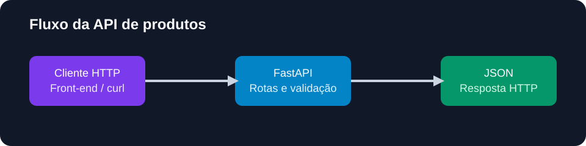

# API de produtos

API REST desenvolvida com FastAPI para consultar, filtrar, cadastrar e excluir
produtos. O projeto pratica back-end, validação de dados, códigos HTTP e
documentação automática.

## Problema

Dashboards e aplicações precisam de uma fonte de dados acessível por HTTP.
Esta API transforma uma lista de produtos em endpoints organizados que podem
ser consumidos por um front-end, outro serviço Python ou ferramentas de teste.

## Endpoints

| Método | Rota | Objetivo |
|---|---|---|
| GET | `/health` | Verificar disponibilidade |
| GET | `/produtos` | Listar produtos |
| GET | `/produtos?categoria=Informática` | Filtrar por categoria |
| GET | `/produtos/filtro/preco?max_price=100` | Filtrar por preço máximo |
| GET | `/produtos/{id}` | Buscar um produto |
| POST | `/produtos` | Cadastrar produto |
| DELETE | `/produtos/{id}` | Excluir produto |

## Exemplo de requisição

```bash
curl http://localhost:8000/produtos
```

Cadastro:

```bash
curl -X POST http://localhost:8000/produtos \
  -H "Content-Type: application/json" \
  -d '{"produto":"Teclado","categoria":"Informática","preco":149.9,"quantidade_vendida":10}'
```

## Tecnologias

- Python 3.11+
- FastAPI
- Pydantic
- Uvicorn
- Pytest

## Como executar localmente

```bash
python -m venv .venv
.\.venv\Scripts\activate
pip install -r requirements.txt
uvicorn main:app --reload
```

Documentação interativa:

- Swagger: `http://localhost:8000/docs`
- ReDoc: `http://localhost:8000/redoc`

## Testes

```bash
pytest -q
```

## Estrutura

```text
main.py              # aplicação FastAPI e endpoints
tests/test_api.py    # testes das regras e respostas HTTP
```



## Observação sobre dados

Esta versão usa uma lista em memória para manter o exercício simples e
reproduzível. Os dados retornam ao estado inicial quando o processo reinicia.
Uma próxima evolução pode usar SQLite ou PostgreSQL.

## Deploy

O repositório está preparado para deploy como função Python no Vercel, que
detecta a instância `app` exportada em `main.py`.
